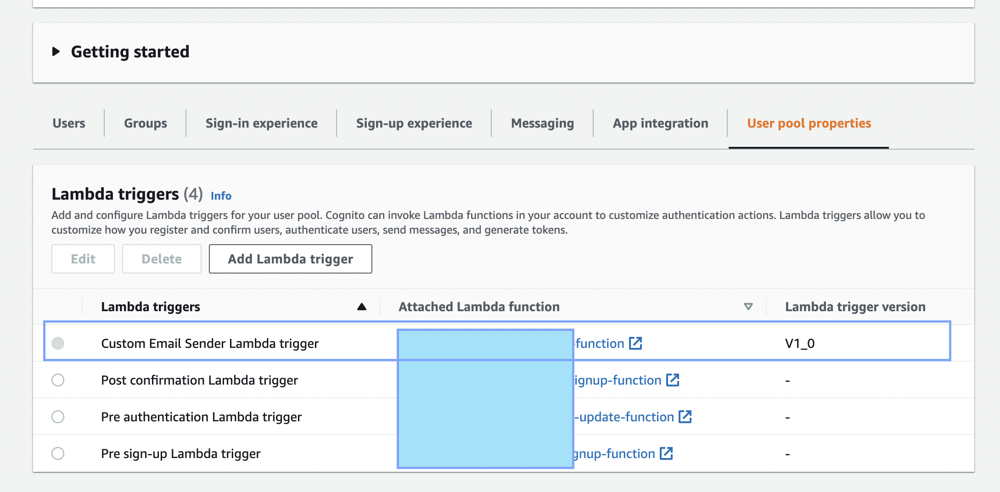

<div style='text-align: center;'>
  Photo by{' '}
  <a href='https://unsplash.com/@brett_jordan?utm_source=unsplash&utm_medium=referral&utm_content=creditCopyText'>
    Brett Jordan
  </a>{' '}
  on{' '}
  <a href='https://unsplash.com/s/photos/network?utm_source=unsplash&utm_medium=referral&utm_content=creditCopyText'>
    Unsplash
  </a>
</div>
AWS SAM way to configure cognito custom email sender

1.  add template yaml as following

```yaml
AWSTemplateFormatVersion: '2010-09-09'
Transform: AWS::Serverless-2016-10-31
Description: >-
  aws-sam-test bench template

Resources:
  CognitoFn:
    Type: 'AWS::Serverless::Function'
    Properties:
      FunctionName: aws-sam-testbench-cognito
      CodeUri: .
      Environment:
        Variables:
          KEY_ID: !GetAtt KmsKey.Arn
      Handler: dist/handlers/cognito.handler
      Runtime: nodejs14.x
      Policies:
        - KMSEncryptPolicy:
            KeyId: !Ref KmsKey
        - KMSDecryptPolicy:
            KeyId: !Ref KmsKey
      Architectures:
        - arm64

  KmsKey:
    Type: AWS::KMS::Key
    Properties:
      Enabled: true
      KeyPolicy:
        Version: '2012-10-17'
        Statement:
          - Effect: Allow
            Principal:
              AWS: !Sub 'arn:aws:iam::211910070328:root'
            Action: 'kms:*'
            Resource: '*'
          - Effect: Allow
            Principal:
              AWS: !Sub 'arn:aws:iam::211910070328:user/canvs.service.1'
            Action:
              - 'kms:Create*'
              - 'kms:Describe*'
              - 'kms:Enable*'
              - 'kms:List*'
              - 'kms:Put*'
              - 'kms:Update*'
              - 'kms:Revoke*'
              - 'kms:Disable*'
              - 'kms:Get*'
              - 'kms:Delete*'
              - 'kms:TagResource'
              - 'kms:UntagResource'
              - 'kms:ScheduleKeyDeletion'
              - 'kms:CancelKeyDeletion'
            Resource: '*'
```

above deploying it will create lambda function and kms key

since aws currently does not support assigning custom email sender function to cognito user pool via aws console dashboard, we need to do it manually via aws cli
[read here](https://docs.aws.amazon.com/cognito/latest/developerguide/user-pool-lambda-custom-email-sender.html)

1. run script on local as following

```yaml
aws lambda add-permission --function-name {lambda_arn} --statement-id "CognitoLambdaInvokeAccess" --action lambda:InvokeFunction --principal cognito-idp.amazonaws.com
```

eg

```yaml
aws lambda add-permission --function-name "arn:aws:lambda:ap-south-1:211910011111:function:aws-sam-testbench-cognito" --statement-id "CognitoLambdaInvokeAccess" --action lambda:InvokeFunction --principal cognito-idp.amazonaws.com
```

1. update user pool with following

```yaml
aws cognito-idp update-user-pool --user-pool-id {user_pool_id} --lambda-config "CustomEmailSender={LambdaVersion=V1_0,LambdaArn={lambda-arn} },KMSKeyID={key-arn}"
```

eg

```yaml
aws cognito-idp update-user-pool --user-pool-id ap-south-1_DDTo62XXX --lambda-config "CustomEmailSender={LambdaVersion=V1_0,LambdaArn= arn:aws:lambda:ap-south-1:2119100111111:function:aws-sam-testbench-cognito },KMSKeyID=arn:aws:kms:ap-south-1:21191001111:key/29c5dc17-8645-46ee-bi9w-efa82b52575d"
```

ref -

- [https://docs.aws.amazon.com/cognito/latest/developerguide/user-pool-lambda-custom-email-sender.html](https://docs.aws.amazon.com/cognito/latest/developerguide/user-pool-lambda-custom-email-sender.html)
- [https://www.maxivanov.io/send-aws-cognito-emails-with-3rd-party-esps/](https://www.maxivanov.io/send-aws-cognito-emails-with-3rd-party-esps/)

Note to configure - [https://stackoverflow.com/questions/67680510/cognito-does-not-call-lambda-function-in-customsmssender](https://stackoverflow.com/questions/67680510/cognito-does-not-call-lambda-function-in-customsmssender)


